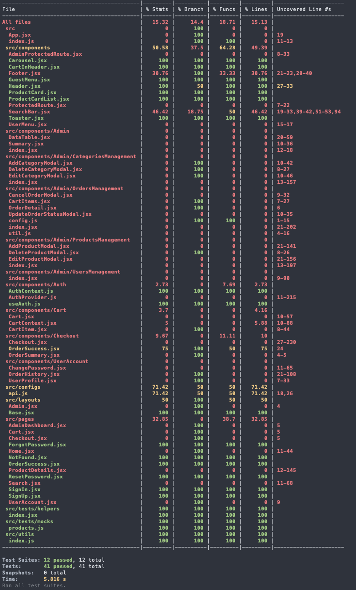
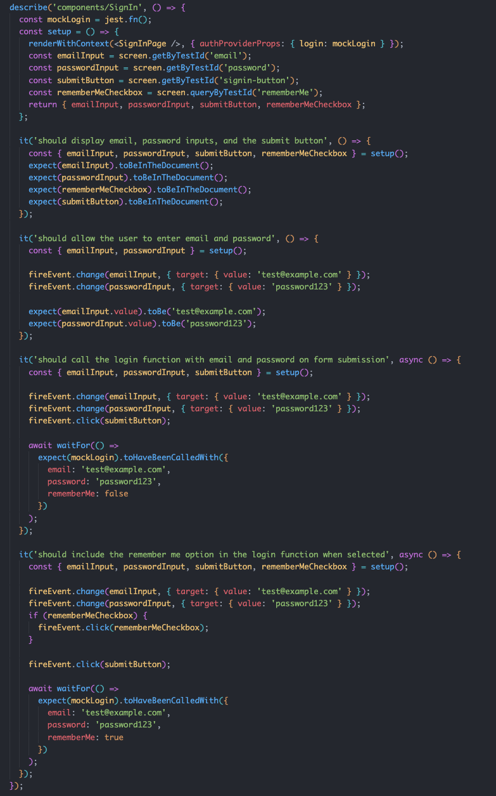
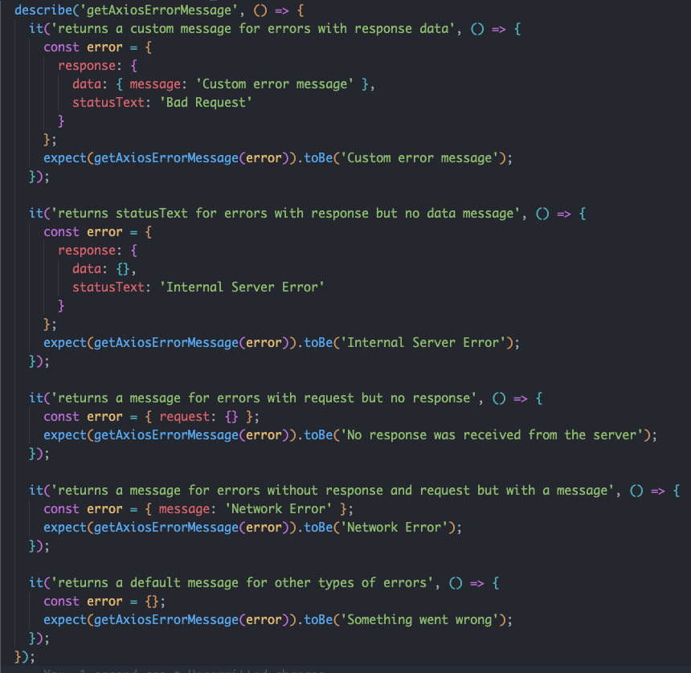

# T3A2 Full Stack App - Part B

## Sakura Pantry - Japanese Online Grocery Store

### Resources

- [Production site](https://sakurapantry.netlify.app/)
- [Front-end repo](https://github.com/irene2mana-T3A2-2023/SakuraPantryClient)
- [Documentation repo](https://github.com/irene2mana-T3A2-2023/SakuraPantryDocs)
- [Part A Documentation Repo](https://github.com/irene2mana-T3A2-2023/SakuraPantryDocs)
- [Trello board](https://trello.com/b/TE5Q9ZYj/t3a2-%F0%9F%8C%B8sakura-pantry)

### Contributors

- [Mana Misumi](https://github.com/Mana12011207)
- [Irene Nguyen](https://github.com/irenenguyen1017)
- [Ellen Pham](https://github.com/ellenpham)

---

## Accessing the Production Application

Please visit the production app at [this link](https://sakurapantry.netlify.app/).

### Overview

This document provides a comprehensive guide to the features and functionalities available in our application. Whether you're a guest, an authenticated user, or an admin, this guide will help you navigate through the app.

#### As a guest, you have the following capabilities

- **View New Arrivals & Featured Products:** Explore our latest and most popular items.
- **Search Products:** Use keywords or categories to find exactly what you're looking for.
- **View Product Details:** Get all the information you need about our products.
- **Add Products to Cart:** Select items you wish to purchase and add them to your cart.
- **View Cart Items:** Check the items currently in your shopping cart.
- **Register a New Account:** Sign up to enjoy more features and a personalized experience.

#### As an authenticated user, you can

- **Login/Logout:** Access your personal account or log out securely.
- **Checkout Purchases:** Complete your shopping experience with a seamless checkout process.
- **Access User Account:** Manage your account details and view your profile.
- **Reset/Change Password:** Ensure your account's security by updating your password as needed.

#### As an admin, you're equipped with extensive controls

- **Admin Dashboard Access:** Oversee the application's operations from a admin dashboard.
- **CRUD Operations:** Create, read, update, and delete products and categories.
- **Manage User Accounts:** View all user accounts within the system.
- **Order Management:** View, update the status of, and cancel orders as necessary.

---

## Installation Instructions

Follow these steps to install and set up the application on your local environment.

### Requirements

**Before proceeding with the installation, ensure you have the following prerequisites:**

- Node.js (version 18 or greater): Ensure you have Node.js version 18 or greater installed on your system. Download it from the [official Node.js website](https://nodejs.org/).

- MongoDB Atlas: If you do not have MongoDB Atlas set up, please follow the MongoDB Atlas installation instructions [here](https://www.mongodb.com/basics/clusters/mongodb-cluster-setup). MongoDB Atlas is essential for database management in the application.

- To enable the email service, set up a Google app password as detailed [here](https://support.google.com/accounts/answer/185833?hl=en), and then provide the credentials in the .`env.development` file.

### API Server Setup

1.**Clone the Repository:**

- Visit the GitHub repository at [SakuraPantryServer](https://github.com/irene2mana-T3A2-2023/SakuraPantryServer)
- Clone the repository to your local machine:

```bash
git clone git@github.com:irene2mana-T3A2-2023/SakuraPantryServer.git
```

2.**Navigate to the Server Directory:**

```bash
cd SakuraPantryServer
```

3.**Install all the required NPM Packages:**

```bash
 npm install
```

4.**Environment Configuration**

- Create a file named `.env.development` in the root of the server directory.
- Copy the contents from `.env.example` to .`env.development` and update it with your actual configuration values.

5.**Seed the dummy data into your MongoDB**

Make sure your MongoDB is running before seeding the database.

```bash
npm run seed:dev
```

6.**Start the local server**

```bash
npm run dev
```

The API server will run on localhost port `5000`, or on the `port` you have configured in the `.env.development` file.

### Client Setup

1.**Clone the Repository:**

- Visit the GitHub repository at [SakuraPantryClient](https://github.com/irene2mana-T3A2-2023/SakuraPantryClient)
- Clone the repository to your local machine:

```bash
git clone git@github.com:irene2mana-T3A2-2023/SakuraPantryClient.git
```

2.**Navigate to the Server Directory:**

```bash
cd SakuraPantryClient
```

3.**Install all the required NPM Packages:**

```bash
 npm install
```

4.**Environment Configuration**

- Create a file named `.env.development` in the root of the server directory.
- Copy the contents from the `.env.example` file into your `.env.development` file and update the `REACT_APP_API_HOST` placeholder with your actual API server's local configuration.

5.**Start the local server**

Make sure your local API server is still running on port `5000`, or on the API server port that you have configured.

```bash
npm start
```

The client server will run on on local host `3000` by default.

6.**Access your local application**

> To view the application as an admin, use the credentials from the admin account provided in the seeded data for login.

- **email**: `admin@example.com`
- **password**: `adminpassword`

> To view the application as a user, you can either use an account from the seeded data or create a new account as any user would.

For example:

- **email**: `bob.smith@example.com`
- **password**: `bobpassword`

We hope you enjoy using our application and have a wonderful experience with it.

---

## Available Scripts

In the project directory, you can run:

```bash
npm start
```

> Launches the server in production mode.
> It sets the `NODE_ENV` environment variable to `production` and starts the application using the main index.js file.

```bash
npm run dev
```

> Launches the server in development mode.
> It uses nodemon for automatic restarting upon file changes and sets `NODE_ENV` to `development`.

```bash
npm run seed:dev
```

> This script will be executed with the environment set to `development`, populating the database with initial data useful for development and testing.

```bash
npm test
```

> Launches the test runner in the interactive watch mode with coverage report. It sets the `NODE_ENV` to `test` and runs Jest with options to detect open handles, collect coverage information, and force exit after tests completion.

```bash
npm run lint
```

> Runs [ESLint](https://eslint.org/) to check for code issues in the `src` directory.
> It helps in maintaining code quality and consistency.

```bash
npm run lint:fix
```

> Automatically fixes fixable issues and suppresses output for warnings.

```bash
npm run format
```

> Uses [Prettier](https://prettier.io/) to format the JavaScript files in the src directory, ensuring a consistent code style across the project.

---

## Server Libraries and Dependencies

### `bcryptjs`

This [package](https://www.npmjs.com/package/bcryptjs]) is used for securely hashing passwords, converting plain text into hashed formats before database storage, thereby enhancing data security against breaches.

### `cors`

Acts as middleware for Express, enabling Cross-Origin Resource Sharing (CORS).\
[CORS](https://github.com/expressjs/cors#readme) is crucial for web application security, as it regulates how a web application can make requests to different domains, ensuring controlled and secure interaction with external resources.

### `cross-env`

This [package](https://github.com/kentcdodds/cross-env) enables the consistent use of environment variables across various operating systems, crucial for ensuring smooth script execution in both Windows and Unix-like environments.

### `crypto-js`

This [library](https://github.com/brix/crypto-js) provides cryptographic functionality in JavaScript. Primarily used in our application for secure encryption and decryption operations, it's essential for generating secure random tokens, hashing, and other cryptographic operations to ensure data security.

### `dotenv`

This [package](https://github.com/motdotla/dotenv) assists in managing environment variables, enhancing security and flexibility by separating configuration from code. It's particularly vital for the secure handling of sensitive data, such as API keys and database credentials.

### `express`

[Express](https://expressjs.com/) is a fast, unopinionated, and minimalist web framework for Node.js, ideal for creating web applications and APIs efficiently and without unnecessary complexity.

### `express-mongo-sanitize`

The [express-mongo-sanitize](https://github.com/fiznool/express-mongo-sanitize) package is a middleware for Express.js applications that helps prevent NoSQL injection attacks by sanitizing user-supplied data before it is used in MongoDB queries. NoSQL injection is a security vulnerability that can occur when untrusted data is used in MongoDB queries without proper validation or sanitization.

### `helmet`

The [helmet](https://helmetjs.github.io/) package is a collection of middleware functions for securing Express.js applications by setting various HTTP headers. These headers help protect against common web vulnerabilities by providing an additional layer of security.

### `joi`

[Joi](https://github.com/hapijs/joi) is a comprehensive schema description language and validator for JavaScript. In our project, it is specifically utilized for validating environment variables. This ensures that our application's configuration adheres to expected formats and standards, providing an additional layer of security and reliability by preventing misconfiguration and potential runtime errors.

### `jsonwebtoken`

Implements [JSON Web Tokens (JWT)](https://github.com/auth0/node-jsonwebtoken) for secure information transmission as JSON objects. Primarily used for user authentication and session management, it issues a JWT upon login, which authenticates further server requests, verifying user identity.

### `mongoose`

[Mongoose](https://mongoosejs.com/) is an Object Data Modelling (ODM) library for MongoDB and Node.js, offering a schema-based solution to effectively model application data and interact with MongoDB databases using JavaScript or TypeScript.

### `nodemailer`

A module for Node.js applications to allow easy email sending. It simplifies the process of sending emails from within the application, whether it's for user verification emails, password reset links, notifications, or any other email-based communication. [The library](https://nodemailer.com/) supports various transport options, including SMTP.

### `slugify`

[Slugify](https://github.com/simov/slugify) is a JavaScript library that is commonly used to create URL-friendly slugs from strings. The Slugify library takes a string as input and transforms it into a URL-friendly slug by removing special characters, converting spaces to hyphens, and ensuring that the resulting string is generally safe for use in a URL.

### `validator`

The [validator](https://github.com/validatorjs/validator.js) package is a library for string validation and sanitization in JavaScript. It provides a wide range of functions to validate and sanitize strings, making it a useful tool for input validation and data cleaning in applications, particularly in web development.

### `xss-clean`

The xss-clean package is a middleware for Express.js applications that helps protect against Cross-Site Scripting (XSS) attacks by sanitizing user input. XSS attacks occur when an application allows untrusted data to be included in web pages without proper validation or escaping, potentially leading to the execution of malicious scripts in the context of the user's browser.

---

## Server Development Dependencies

Our project uses a variety of development tools to streamline the development process and ensure code quality. Below is a list of the development dependencies specified in our `package.json` file:

### `eslint`

A static code analysis [tool](https://eslint.org/) that helps identify and fix patterns in JavaScript code, enhancing consistency and preventing bugs.

### `eslint-config-prettier`

This [package](https://github.com/prettier/eslint-config-prettier) disables conflicting ESLint rules to ensure seamless integration with Prettier, optimizing code formatting consistency.

### `eslint-plugin-import`

This [plugin](https://github.com/import-js/eslint-plugin-import) enhances code quality and consistency by supporting linting of ES2015+ import/export syntax, helping prevent issues like misspelling in file paths and import names.

### `eslint-plugin-jest`

This [plugin](https://github.com/jest-community/eslint-plugin-jest) provides ESLint rules specifically for Jest, aiding in enforcing best practices and identifying common errors in Jest test files.

### `eslint-plugin-prettier`

This [plugin](https://github.com/prettier/eslint-plugin-prettier) integrates Prettier into ESLint, running it as a rule and reporting format differences as ESLint issues, thus combining code formatting with linting.

### `jest`

[Jest](https://jestjs.io/) is a simple yet comprehensive JavaScript testing framework, offering a ready-to-use solution for effective testing.

### `mongodb-memory-server`

This [tool](https://github.com/nodkz/mongodb-memory-server) programmatically launches a real MongoDB server within Node.js for testing or development purposes.

### `nodemon`

[Nodemon](https://www.npmjs.com/package/nodemon) is a utility that automatically restarts your server when code changes are detected, improving the development workflow.

### `prettier`

[Prettier](https://prettier.io/) is an opinionated code formatter that supports multiple languages, ensuring a consistent code style throughout your project.

### `supertest`

A [SuperAgent-driven](https://github.com/ladjs/supertest) library for testing HTTP servers, allowing you to test your REST API endpoints.

---

## API Endpoints

### Products

<table>
    <thead>
        <tr>
            <th>Method</th>
            <th>Routes</th>
            <th>Functionality</th>
            <th>Access</th>
        </tr>
    </thead>
    <tbody>
        <tr>
            <td>GET</th>
            <td>/api/products</th>
            <td>Get a list of all products</th>
            <td>Public</th>
        </tr>
        <tr>
            <td>GET</th>
            <td>/api/products/:slug</th>
            <td>Get details of a specific product by slug</th>
            <td>Public</td>
        </tr>
        <tr>
            <td>POST</th>
            <td>/api/products</th>
            <td>Create a new product</th>
            <td>Private/Admin</td>
        </tr>
        <tr>
            <td>PATCH</th>
            <td>/api/products/:slug</th>
            <td>Update a specific product by slug</th>
            <td>Private/Admin</td>
        </tr>
        <tr>
            <td>DELETE</th>
            <td>/api/products/:slug</th>
            <td>Delete a specific product by slug</th>
            <td>Private/Admin</th>
        </tr>
        <tr>
            <td>GET</th>
            <td>/products/new-arrivals</th>
            <td>Get a list of new arrival products</th>
            <td>Public</td>
        </tr>
        <tr>
            <td>GET</th>
            <td>/products/feature</th>
            <td>Get a list of featured products</th>
            <td>Public</td>
        </tr>
        <tr>
            <td>GET</th>
            <td>/products/relative-products/:categorySlug</th>
            <td>Get related products</th>
            <td>Public</td>
        </tr>
        <tr>
            <td>GET</th>
            <td>/products/search?k=abc&c=def</th>
            <td>Get products by keyword and categorySlug</th>
            <td>Public</td>
        </tr>
    </tbody>
</table>

### Categories

<table>
    <thead>
        <tr>
            <th>Method</th>
            <th>Routes</th>
            <th>Functionality</th>
            <th>Access</th>
        </tr>
    </thead>
    <tbody>
        <tr>
            <td>GET</th>
            <td>/api/categories</th>
            <td>Get a list of all categories</th>
            <td>Public</th>
        </tr>
        <tr>
            <td>POST</th>
            <td>/api/categories</th>
            <td>Create a new categories</th>
            <td>Private/Admin</td>
        </tr>
        <tr>
            <td>PATCH</th>
            <td>/api/categories/:slug</th>
            <td>Update a specific category by slug</th>
            <td>Private/Admin</td>
        </tr>
        <tr>
            <td>DELETE</th>
            <td>/api/categories/:slug</th>
            <td>Delete a specific category by slug</th>
            <td>Private/Admin</td>
        </tr>
    </tbody>
</table>

### Orders

<table>
    <thead>
        <tr>
            <th>Method</th>
            <th>Routes</th>
            <th>Functionality</th>
            <th>Access</th>
        </tr>
    </thead>
    <tbody>
        <tr>
            <td>GET</th>
            <td>/api/orders</th>
            <td>Get a list of all orders</th>
            <td>Private/Admin</th>
        </tr>
        <tr>
            <td>GET</th>
            <td>/api/orders/myorders</th>
            <td>Get all orders of the current logged in user</th>
            <td>Private/Auth user</td>
        </tr>
        <tr>
            <td>GET</th>
            <td>/api/orders/:id</th>
            <td>Get an order by ID</th>
            <td>Private/Admin and Auth user</td>
        </tr>
        <tr>
            <td>POST</th>
            <td>/api/orders</th>
            <td>Create an order</th>
            <td>Private/Auth user</td>
        </tr>
        <tr>
            <td>PATCH</th>
            <td>/api/orders/:id/status</th>
            <td>Update an order's status</th>
            <td>Private/Auth user</td>
        </tr>
    </tbody>
</table>

### Authentication

<table>
    <thead>
        <tr>
            <th>Method</th>
            <th>Routes</th>
            <th>Functionality</th>
            <th>Access</th>
        </tr>
    </thead>
    <tbody>
        <tr>
            <td>GET</th>
            <td>/api/auth/current-user</th>
            <td>Retrieve the currently logged-in user</th>
            <td>Private/Admin and Auth user</th>
        </tr>
        <tr>
            <td>POST</th>
            <td>/api/auth/register</th>
            <td>Create a new user account</th>
            <td>Public</th>
        </tr>
        <tr>
            <td>POST</th>
            <td>/api/auth/login</th>
            <td>Authenticates a user and issues a JWT token</th>
            <td>Public</td>
        </tr>
        <tr>
            <td>POST</th>
            <td>/api/auth/forgot-password</th>
            <td>Initiates the password recovery process</th>
            <td>Public</td>
        </tr>
        <tr>
            <td>POST</th>
            <td>/api/auth/reset-password</th>
            <td>Completes password recovery using a reset token</th>
            <td>Public</td>
        </tr>
        <tr>
            <td>POST</th>
            <td>/api/auth/verify-current-password</th>
            <td>Verify the current logged in user's password</th>
            <td>Private/Auth user</td>
        </tr>
        <tr>
            <td>POST</th>
            <td>/api/auth/change-password</th>
            <td>Update the current logged in user's password</th>
            <td>Private/Auth user</td>
        </tr>
    </tbody>
</table>

### Users

<table>
    <thead>
        <tr>
            <th>Method</th>
            <th>Routes</th>
            <th>Functionality</th>
            <th>Access</th>
        </tr>
    </thead>
    <tbody>
        <tr>
            <td>GET</th>
            <td>/api/users</th>
            <td>Get a list of all users</th>
            <td>Private/Admin</th>
        </tr>
    </tbody>
</table>

### Admin Dashboard

<table>
    <thead>
        <tr>
            <th>Method</th>
            <th>Routes</th>
            <th>Functionality</th>
            <th>Access</th>
        </tr>
    </thead>
    <tbody>
        <tr>
            <td>GET</th>
            <td>/api/dashboard/summary</th>
            <td>Get all summary information for admin dashboard</th>
            <td>Private/Admin</th>
        </tr>
    </tbody>
</table>

---

## Project Management Methodology 

*Tasks planning and delegation + Trello screenshots will go here...*

---

## User Testing

### Production testing

*Excel Spreadsheet will go here....*

### API development and testing

We used `jest` and `supertest` as our testing libraries. The back-end automated tests were written with `jest`, complemented by manual API tests using Insomnia.

Below are several screenshots from manual tests conducted during the development using Insomnia, which illustrate key functionalities of the website.

Users log in


Registering a user


Search products by keyword, filtered by categories


Creating a new product


Creating a new order


Error handling was implemented to address various scenarios. Common Mongoose errors, including CastError, Duplicate Fields Error, and Validation Error, were gracefully handled throughout all functionalities. 


All routes underwent comprehensive testing to monitor their HTTP responses.


At the same time, in the front-end, we ensure that the functionality of corresponding features seamlessly aligns with the APIs.

Registering a user (with existed email)


Users log in


Search products by keyword, filtered by categories


Creating a new product


Creating a new order


Errors handling:

Register with invalid email


Create order with missing or invalid input fields


Create product with the existed product name


---

## Testing framework with Jest/Supertest

### Server side testing

For automated tests, we have tried to write tests for all routes and across all CRUD functionality. We have not had the capabilities of completing tests for other functions in `authMiddleware.js` and `errorHandlingMiddleware.js`, we have alternatively tested with API testing tool to observe the HTTP responses.


We also implemented both integration and unit tests across key workflows for ensuring the robustness and accuracy of the implemented functionality and error handlers.

#### Server integration tests


#### Server unit tests


### Client side testing

In our frontend testing, we've achieved extensive coverage of essential UI elements and user interactions through manual testing. However, we couldn't fully extend our automated testing to cover certain complex dynamic features, primarily due to the sheer volume of tests required and time constraints. As a result, our automated test coverage currently stands at approximately 15%.



#### Client integration tests



#### Client unit tests


