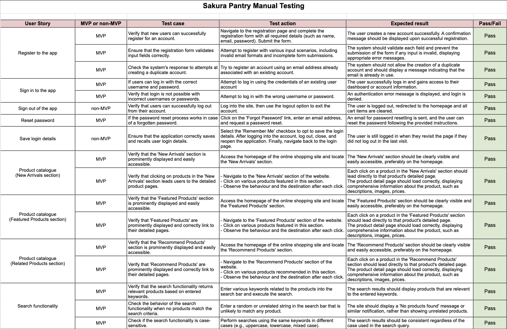
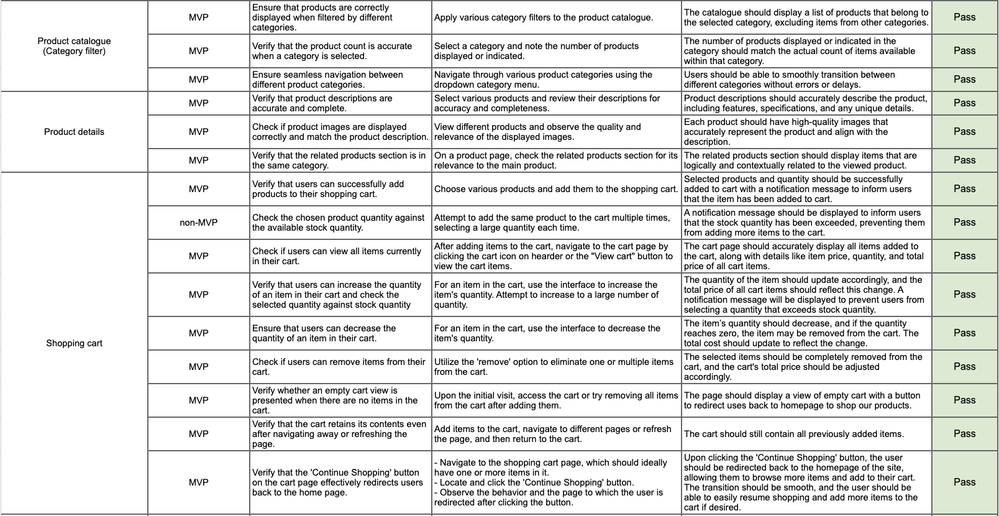
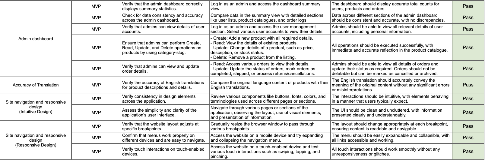

# T3A2 Full Stack App - Part B

## Sakura Pantry - Japanese Online Grocery Store

### Resources

- [Production Site](https://sakurapantry.netlify.app/)
- [Front-end Repo](https://github.com/irene2mana-T3A2-2023/SakuraPantryClient)
- [Back-end Repo](https://github.com/irene2mana-T3A2-2023/SakuraPantryServer)
- [Part A Documentation Repo](https://github.com/irene2mana-T3A2-2023/SakuraPantryDocs)
- [Trello Board](https://trello.com/b/TE5Q9ZYj/t3a2-%F0%9F%8C%B8sakura-pantry)

### Contributors

- [Mana Misumi](https://github.com/Mana12011207)
- [Irene Nguyen](https://github.com/irenenguyen1017)
- [Ellen Pham](https://github.com/ellenpham)

## Installation Instructions

*App installation and usage will go here...*

## Scripts

In the project directory, you can run:

`npm start`

Launches the server in production mode.\
It sets the `NODE_ENV` environment variable to `production` and starts the application using the main index.js file.

`npm run dev`

Launches the server in development mode.\
It uses nodemon for automatic restarting upon file changes and sets `NODE_ENV` to `development`.

`npm test`

Launches the test runner in the interactive watch mode with coverage report. It sets the `NODE_ENV` to `test` and runs Jest with options to detect open handles, collect coverage information, and force exit after tests completion.

`npm run lint`

Runs [ESLint](https://eslint.org/) to check for code issues in the `src` directory.\
It helps in maintaining code quality and consistency.

`npm run lint:fix`

Automatically fixes fixable issues and suppresses output for warnings.

`npm run format`

Uses [Prettier](https://prettier.io/) to format the JavaScript files in the src directory, ensuring a consistent code style across the project.

```bash
npm run format
```

> Uses [Prettier](https://prettier.io/) to format the JavaScript files in the src directory, ensuring a consistent code style across the project.

---

## Server Libraries and Dependencies

`bcryptjs`

Used for hashing passwords securely. It protects user data by converting plain text passwords into hashed formats before database storage, enhancing security against data breaches.

`cors`

Acts as middleware for Express, enabling Cross-Origin Resource Sharing (CORS).\
CORS is crucial for web application security, as it regulates how a web application can make requests to different domains, ensuring controlled and secure interaction with external resources.

`cross-env`

Enables consistent use of environment variables across different operating systems, essential for scripts to work smoothly on both Windows and Unix-like environments.

`crypto-js`

JavaScript library that provides cryptographic functionality. In our application, it's primarily used for secure encryption and decryption operations. This can include generating secure random tokens, hashing, or any other cryptographic needs that ensure data security within our application.

`dotenv`

Facilitates the management of environment variables. By separating configuration from code, it enhances security and flexibility, especially crucial for handling sensitive data like API keys and database credentials.

`express`

A fast, unopinionated, minimalist web framework for Node.js, perfectly suited for efficiently building web applications and APIs without unnecessary complexity.

`mongoose`

An Object Data Modelling (ODM) library for MongoDB and Node.js. It provides a straightforward, schema-based solution to model your application data and interact with MongoDB databases using JavaScript or TypeScript.

`joi`

Joi is a comprehensive schema description language and validator for JavaScript. In our project, it is specifically utilized for validating environment variables. This ensures that our application's configuration adheres to expected formats and standards, providing an additional layer of security and reliability by preventing misconfiguration and potential runtime errors.

`jsonwebtoken`

Implements JSON Web Tokens (JWT) for secure information transmission as JSON objects. Primarily used for user authentication and session management, it issues a JWT upon login, which authenticates further server requests, verifying user identity.

`slugify`

Slugify is a JavaScript library that is commonly used to create URL-friendly slugs from strings. The Slugify library takes a string as input and transforms it into a URL-friendly slug by removing special characters, converting spaces to hyphens, and ensuring that the resulting string is generally safe for use in a URL.

`nodemailer`

A module for Node.js applications to allow easy email sending. It simplifies the process of sending emails from within the application, whether it's for user verification emails, password reset links, notifications, or any other email-based communication. The library supports various transport options, including SMTP.

`validator`

The validator package is a library for string validation and sanitization in JavaScript. It provides a wide range of functions to validate and sanitize strings, making it a useful tool for input validation and data cleaning in applications, particularly in web development.

`helmet`

The helmet package is a collection of middleware functions for securing Express.js applications by setting various HTTP headers. These headers help protect against common web vulnerabilities by providing an additional layer of security.

`express-mongo-sanitize`

The express-mongo-sanitize package is a middleware for Express.js applications that helps prevent NoSQL injection attacks by sanitizing user-supplied data before it is used in MongoDB queries. NoSQL injection is a security vulnerability that can occur when untrusted data is used in MongoDB queries without proper validation or sanitization.

---

## Server Development Dependencies

Our project uses a variety of development tools to streamline the development process and ensure code quality. Below is a list of the development dependencies specified in our `package.json` file:

`eslint`

A static code analysis tool that helps identify and fix patterns in JavaScript code, enhancing consistency and preventing bugs.

`eslint-config-prettier`

Disables all ESLint rules that conflict with Prettier, ensuring seamless integration of ESLint with Prettier for code formatting.

`eslint-plugin-jest`

Provides ESLint rules for Jest, helping to enforce best practices and catch common mistakes in Jest test files.

`eslint-plugin-prettier`

Runs Prettier as an ESLint rule and reports differences as individual ESLint issues, integrating code formatting into the linting process.

`jest`

A delightful JavaScript testing framework with a focus on simplicity, providing a complete and ready-to-use testing solution.

`mongodb-memory-server`

Spins up an actual/real MongoDB server programmatically from within Node.js, for testing or mocking during development.

`nodemon`

A utility that monitors for any changes in your source code and automatically restarts your server, enhancing the development experience.

`prettier`

An opinionated code formatter that supports multiple languages and integrates with most editors to ensure consistent code style across the project.

`supertest`

[Prettier](https://prettier.io/) is an opinionated code formatter that supports multiple languages, ensuring a consistent code style throughout your project.

### `supertest`

A [SuperAgent-driven](https://github.com/ladjs/supertest) library for testing HTTP servers, allowing you to test your REST API endpoints.

---

## API Endpoints

### Products

<table>
    <thead>
        <tr>
            <th>Method</th>
            <th>Routes</th>
            <th>Functionality</th>
            <th>Access</th>
        </tr>
    </thead>
    <tbody>
        <tr>
            <td>GET</th>
            <td>/api/products</th>
            <td>Get a list of all products</th>
            <td>Public</th>
        </tr>
        <tr>
            <td>GET</th>
            <td>/api/products/:slug</th>
            <td>Get details of a specific product by slug</th>
            <td>Public</td>
        </tr>
        <tr>
            <td>POST</th>
            <td>/api/products</th>
            <td>Create a new product</th>
            <td>Private/Admin</td>
        </tr>
        <tr>
            <td>PATCH</th>
            <td>/api/products/:slug</th>
            <td>Update a specific product by slug</th>
            <td>Private/Admin</td>
        </tr>
        <tr>
            <td>DELETE</th>
            <td>/api/products/:slug</th>
            <td>Delete a specific product by slug</th>
            <td>Private/Admin</th>
        </tr>
        <tr>
            <td>GET</th>
            <td>/products/new-arrivals</th>
            <td>Get a list of new arrival products</th>
            <td>Public</td>
        </tr>
        <tr>
            <td>GET</th>
            <td>/products/feature</th>
            <td>Get a list of featured products</th>
            <td>Public</td>
        </tr>
        <tr>
            <td>GET</th>
            <td>/products/relative-products/:categorySlug</th>
            <td>Get related products</th>
            <td>Public</td>
        </tr>
        <tr>
            <td>GET</th>
            <td>/products/search?k=abc&c=def</th>
            <td>Get products by keyword and categorySlug</th>
            <td>Public</td>
        </tr>
    </tbody>
</table>

### Categories

<table>
    <thead>
        <tr>
            <th>Method</th>
            <th>Routes</th>
            <th>Functionality</th>
            <th>Access</th>
        </tr>
    </thead>
    <tbody>
        <tr>
            <td>GET</th>
            <td>/api/categories</th>
            <td>Get a list of all categories</th>
            <td>Public</th>
        </tr>
        <tr>
            <td>POST</th>
            <td>/api/categories</th>
            <td>Create a new categories</th>
            <td>Private/Admin</td>
        </tr>
        <tr>
            <td>PATCH</th>
            <td>/api/categories/:slug</th>
            <td>Update a specific category by slug</th>
            <td>Private/Admin</td>
        </tr>
        <tr>
            <td>DELETE</th>
            <td>/api/categories/:slug</th>
            <td>Delete a specific category by slug</th>
            <td>Private/Admin</td>
        </tr>
    </tbody>
</table>

### Orders
<table>
    <thead>
        <tr>
            <th>Method</th>
            <th>Routes</th>
            <th>Functionality</th>
            <th>Access</th>
        </tr>
    </thead>
    <tbody>
        <tr>
            <td>GET</th>
            <td>/api/orders</th>
            <td>Get a list of all orders</th>
            <td>Private/Admin</th>
        </tr>
        <tr>
            <td>GET</th>
            <td>/api/orders/myorders</th>
            <td>Get all orders of the current logged in user</th>
            <td>Private/Auth user</td>
        </tr>
        <tr>
            <td>GET</th>
            <td>/api/orders/:id</th>
            <td>Get an order by ID</th>
            <td>Private/Admin and Auth user</td>
        </tr>
        <tr>
            <td>POST</th>
            <td>/api/orders</th>
            <td>Create an order</th>
            <td>Private/Auth user</td>
        </tr>
        <tr>
            <td>PATCH</th>
            <td>/api/orders/:id/status</th>
            <td>Update an order's status</th>
            <td>Private/Auth user</td>
        </tr>
    </tbody>
</table>

### Authentication

<table>
    <thead>
        <tr>
            <th>Method</th>
            <th>Routes</th>
            <th>Functionality</th>
            <th>Access</th>
        </tr>
    </thead>
    <tbody>
        <tr>
            <td>POST</th>
            <td>/api/auth/register</th>
            <td>Create a new user account</th>
            <td>Public</th>
        </tr>
        <tr>
            <td>POST</th>
            <td>/api/auth/login</th>
            <td>Authenticates a user and issues a JWT token</th>
            <td>Public</td>
        </tr>
        <tr>
            <td>POST</th>
            <td>/api/auth/forgot-password</th>
            <td>Initiates the password recovery process</th>
            <td>Public</td>
        </tr>
        <tr>
            <td>POST</th>
            <td>/api/auth/reset-password</th>
            <td>Completes password recovery using a reset token</th>
            <td>Private/Auth user</td>
        </tr>
        <tr>
            <td>POST</th>
            <td>/api/auth/verify-current-password</th>
            <td>Verify the current logged in user's password</th>
            <td>Private/Auth user</td>
        </tr>
        <tr>
            <td>POST</th>
            <td>/api/auth/change-password</th>
            <td>Update the current logged in user's password</th>
            <td>Private/Auth user</td>
        </tr>
    </tbody>
</table>

### Users

<table>
    <thead>
        <tr>
            <th>Method</th>
            <th>Routes</th>
            <th>Functionality</th>
            <th>Access</th>
        </tr>
    </thead>
    <tbody>
        <tr>
            <td>GET</th>
            <td>/api/users</th>
            <td>Get a list of all users</th>
            <td>Private/Admin</th>
        </tr>
    </tbody>
</table>

### Admin Dashboard

<table>
    <thead>
        <tr>
            <th>Method</th>
            <th>Routes</th>
            <th>Functionality</th>
            <th>Access</th>
        </tr>
    </thead>
    <tbody>
        <tr>
            <td>GET</th>
            <td>/api/dashboard/summary</th>
            <td>Get all summary information for admin dashboard</th>
            <td>Private/Admin</th>
        </tr>
    </tbody>
</table>

---

## Project Management Methodology 

*Tasks planning and delegation + Trello screenshots will go here...*

---

## User Testing

### Production testing
We conducted manual testing in a production environment to verify that the application performed as expected under real-world conditions, and we confirmed that all test cases were successfully passed.






### API development and testing

We used `jest` and `supertest` as our testing libraries. The back-end automated tests were written with `jest`, complemented by manual API tests using Insomnia.

Below are several screenshots from manual tests conducted during the development using Insomnia, which illustrate key functionalities of the website.

Users log in


Registering a user


Search products by keyword, filtered by categories


Creating a new product


Creating a new order


Error handling was implemented to address various scenarios. Common Mongoose errors, including CastError, Duplicate Fields Error, and Validation Error, were gracefully handled throughout all functionalities. 


All routes underwent comprehensive testing to monitor their HTTP responses.


At the same time, in the front-end, we ensure that the functionality of corresponding features seamlessly aligns with the APIs.

Registering a user (with existed email)


Users log in


Search products by keyword, filtered by categories


Creating a new product


Creating a new order


Errors handling:

Register with invalid email


Create order with missing or invalid input fields


Create product with the existed product name


---

## Testing framework with Jest/Supertest

### Server side testing

For automated tests, we have tried to write tests for all routes and across all CRUD functionality. We have not had the capabilities of completing tests for other functions in `authMiddleware.js` and `errorHandlingMiddleware.js`, we have alternatively tested with API testing tool to observe the HTTP responses. 


We also implemented both integration and unit tests across key workflows for ensuring the robustness and accuracy of the implemented functionality and error handlers.

**Integration tests**


**Unit tests**


### Client side testing 

